# Job Portal Web Application

<p align="center">


</p>

**Hotel-Management-Booking-App-React-Part** – React frontend for a Hotel Management Booking Application.

---

## 📑 Table of Contents

* [Tech Stack](#-tech-stack)
* [How to Run the Project](#-how-to-run-the-project)
* [Screenshots](#-screenshots)
* [Project Structure](#-project-structure)

---

## 🏗 Tech Stack

* **React 19**
* **Styling:** HTML, CSS, Bootstrap 

---

## 🚀 How to Run the Project

1.  **Clone the repository:**
    ```bash
    git clone https://github.com/rakets/Hotel-Management-Booking-App-React-Part.git
    ```
2.  **Go to the project folder:**
    ```bash
    cd Hotel-Management-Booking-App-React-Part
    ```
3. **Install dependencies:**
    ```bash
    npm install
    ```
    ```bash
    npm install react-scripts –save
    ```
4.  **Start the development server:**
    ```bash
    npm start
    ```
    The application will be available at `http://localhost:3000`.

---

## 📸 Screenshots

<p align="center">
  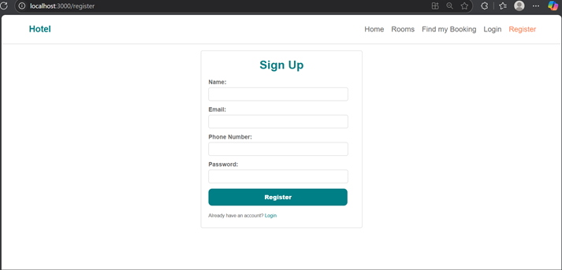
  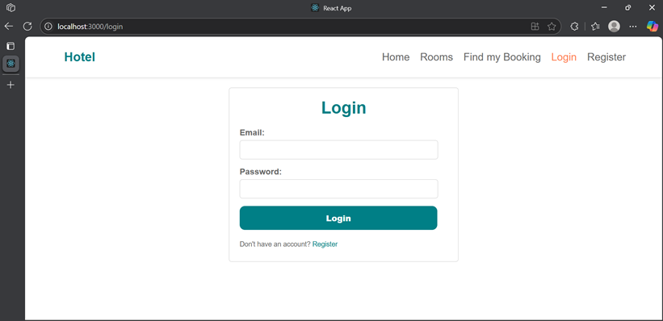
  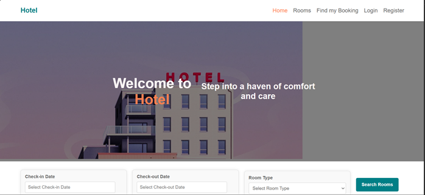
  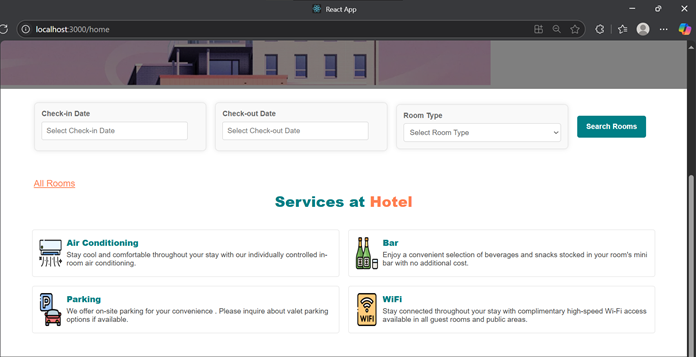
  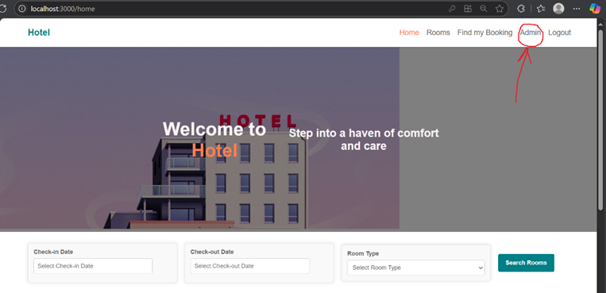
  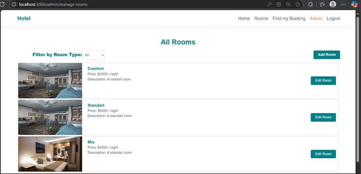
  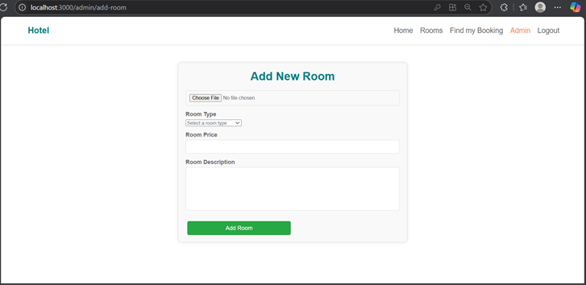
  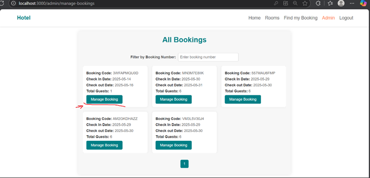
  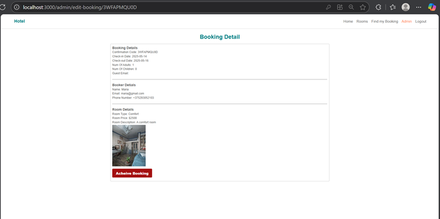
  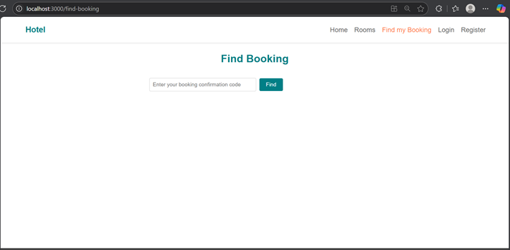
  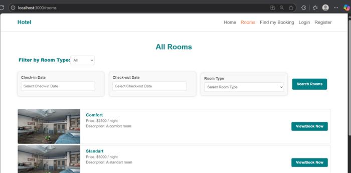
  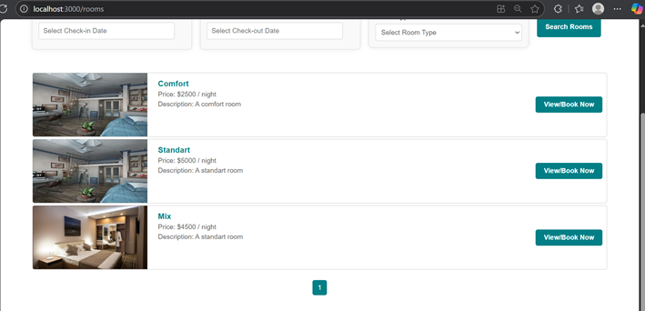
  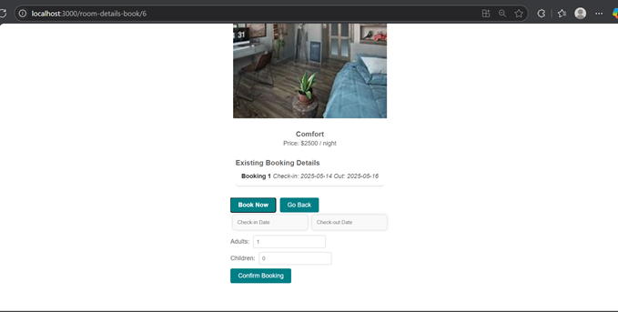
</p>

---

## 📂 Project Structure

<p align="center">
  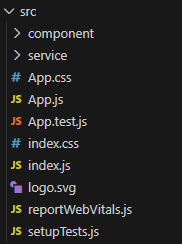
  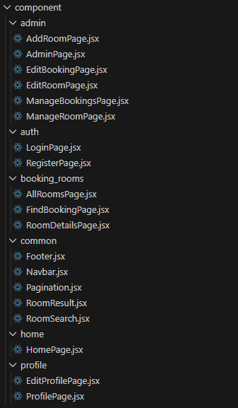
  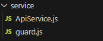
</p>
